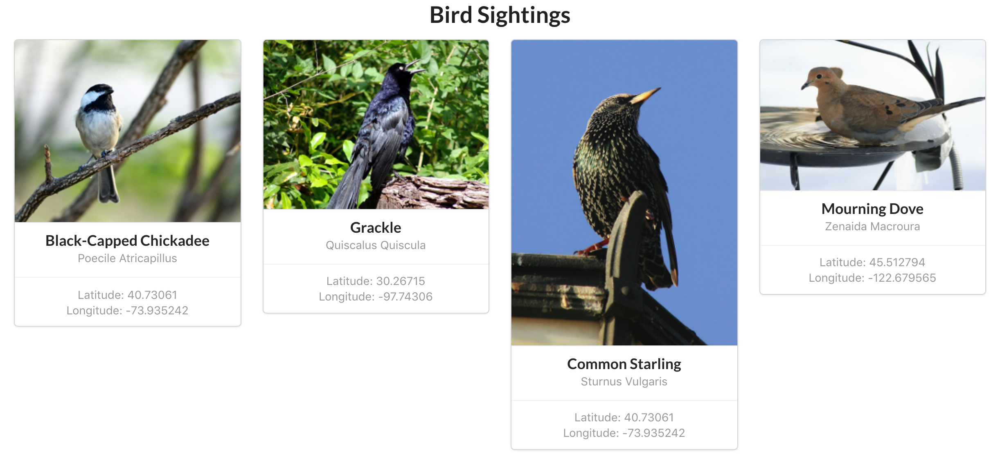

# UCI Mod 8 Assessment

## Introduction

In this assessment, your task is to build out an entire full-stack web
application using a Rails back-end and a React front-end. Connecting the two, you
will be able to run the Rails server, fetch and display data from that server in
the React and persist data to the server using your front-end.

Your task today is to build a bird watching application. A person using this
application should be able to visit the front-end and see when and where
different birds have been sighted. That person should also be able to submit
their _own_ sightings using a form.

In order to make this possible, you will have to build out both sides of the
application together. The steps required for building both the back-end and
front-end are listed below.

## What is Already Provided

This application will be divided into two parts - the back-end and front-end.
The file structures of both are already provided for you in the `back-end` and
`front-end` folders. Migrations and some initial seed data are included in the
Rails back-end, so start by following the instructions below to build out the
necessary model and controller code. Once you've got the back-end working, you
will have some data to work with and can begin building out your React
front-end.

The existing React code uses Semantic UI for styling to help with the look of
the application. No additional styling should be required.

## Instructions

### Part 1: Connecting the Back-End and Front-End

#### Building the Rails Back-End

The files provided in `back-end` are from an API-only build of Rails. This means
that there are **no views** and that any controller actions you write should
render JSON.

##### Migrations and Models

The migrations are already provided in `back-end/db`. Inside
`back-end/db/seeds.rb` some seed data is also available. Three models are
listed, `Bird`, `Location`, and `Sighting`.

Your first task is to create the models that will work with these seeds. The
models have the following relationships:

* `Bird` has many `Sighting`s
* `Location` has many `Sighting`s
* `Sighting` belongs to `Bird`
* `Sighting` belongs to `Location`

With this setup, one bird and one location are _joined_ together with a
sighting.

Once the correct models and relations are in place, you should be able to
migrate and seed the database. From the `back-end` folder, run
`rails db:migrate`, then `rails db:seed`.

You can confirm everything is working by running `rails console` and interacting
with the models (i.e. `Bird.all`).

##### Controllers and Routes

For this part of the assessment, we will focus on providing one API endpoint
that renders data on all sightings. Sticking to RESTful conventions, this means
we will need a `SightingsController` and an `index` action.

Start by updating `config/routes.rb` to allow for this route. Once configured,
create the needed controller and action. Remember, `SightingsController#index`
should render JSON.

Once built, you should now be able to run `rails server`, navigate to
http://localhost:3000/sightings and view the seed data in JSON format. This
works but the information is limited since sightings themselves don't contain
a lot of useful information.

When we get to the front-end, we'll need to retrieve data using this action, but
not all of the data we need is available. Rather than creating more endpoints to
retrieve data from, it would be helpful for this action to not only render
sighting data, but also any related data from the bird and location models.

This way, if we send a `fetch()` request to get all _sightings_, we can also get
data about the bird and location related to each of those sightings, **all in
one request**. Specifically, for each sighting, we'll need the associated bird's
name, species and image URL, as well as the latitude and longitude of the
sighting location.

_How_ you choose to **include** this data is up to you.

We will come back to the back-end later, but with this basic structure working,
let's move on to the front-end.

**Note:** To work with both a front-end and back-end at the same time, we'll
need to have to terminal windows open. It may be easiest to start up your Rails
server now and open a new terminal before working on the front-end.

#### Building the Front-End

In the `front-end` folder is a React build with some existing content provided.
Running `npm install` and `npm start` should open a webpage with 'Bird
Sightings' on it (on `localhost:3001` if you already have your Rails server
running).

If you take a look in `front-end/src`, you will be able to see what code is
already provided. For this part of the assessment, you will need to work
primarily in three components, `SightingsPage`, `SightingsContainer` and
`SightingCard`.

`SightingCard` is a presentational component - its structure and styling are
already provided. It is up to you to get the data into it via props.

The `SightingsContainer` is a container component and should be the parent
container of all `SightingCard`s. Use this component to handle the logic of
rendering `SightingCard`s.

The `SightingsPage` contains `SightingsContainer` as well as the `Header`
component. It also contains some initial code for us, including a place for
sightings to be stored in component state.

`SightingsPage` is the highest container below `App`.

##### Fetching Back-End Data

We've got a working front-end, but no data, which will make it difficult to
build our components out. From the `SightingsPage`, fetch sighting data
from your back-end using the endpoint created in the previous section
(http://localhost:3000/sightings) and store it in state.

This data, at a minimum, should be an array of sightings, including the
associated bird for each, it's name, species and image URL and the associated
location data.

##### Rendering Bird Sightings

Using the newly fetched data data in state, write the necessary code in
`SightingsPage`, `SightingsContainer`, and `SightingCard` to get each bird
sighting to display with its associated bird image, name, and species as well as
the sighting's latitude and longitude, passing props down as needed.

Once your code is written, you should be able to visit your front-end in the
browser and see something similar to below:

If you're seeing all the correct information, you're successfully rendering
content from your Rails API in React. This is a good time to commit your work.

### Part 2: Sending Data from the Front-End to the Back-End

For this part, your task is to update both the back-end and front-end once
again. You've so far been able to retrieve data from our Rails API. Now, you
will need to send data to it. A visitor to the React site should be able to
submit their own bird sightings.

There are multiple ways to approach this task so it is up to you to decide what
component(s) you will need to create in React to handle form submission and what
additional controller action(s) and route(s) you will need to build into your Rails
API.

While it is not required, you can apply the classes `ui` and  `form` to the form you
create in JSX and take advantage of the provided Semantic styling. In the
example GIF below, a form component was created using this styling and placed
directly after the `Header` component.

#### Working Through the Problem

Remember, a sighting is the _join_ between a specific _bird_ and _location_ in
the Rails API, and will need that information in order to be created. Since
you're working with sending data from the front-end to the back-end, it may be
easiest to start with React. You are not required to follow the below steps, but
they may help guide you:

1. Create a new React component for your sightings form, connecting it to the
   existing components where appropriate
2. This form should allow a user to enter the latitude and longitude of a
   sighting
3. For simplicity, this form should just let a user [select][] from a list of
   existing birds, rather than try to handle new bird creation
4. On submit, the data entered into the form should be sent to the Rails API via
   a POST request. Maintaining RESTful standards would mean this POST request
   should be sent to the `/sightings` endpoint
5. On the back-end, enable the corresponding route
6. Create a controller action and any additional private methods to handle the
   incoming POST data. A few things will need to be done to the incoming data:

    * The correct `Bird` instance needs to be found
    * The `Location` instance should ideally be found or created
    * Using these two things, a new `Sighting` should be created

7. Upon successful creation, send back whatever JSON data is needed to the
   front-end to update the display of _all_ bird sightings and handle accordingly
   in React

If successful, upon form submission, the new sighting should display in your
React app after being saved to your database. You've now retrieved and posted
data between the front-end and back-end of an application!

[select]: https://www.w3schools.com/tags/tag_select.asp
